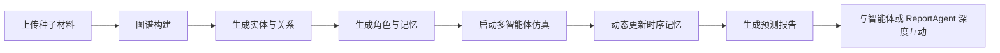

<div align="center">


# MiroFish-Pro

### 面向长时间运行仿真的稳定性增强版 MiroFish 社区分支

**从现实种子材料构建平行数字世界，让复杂的“如果发生”可以被模拟、观察和复盘。**

[](https://github.com/Tena-Sen/MiroFish-Pro/stargazers)
[](./LICENSE)
[](https://www.python.org/)
[](https://nodejs.org/)
[](https://www.docker.com/)

[中文文档](./README-ZH.md) · [上游 MiroFish](https://github.com/666ghj/MiroFish) · [在线 Demo](https://666ghj.github.io/mirofish-demo/)

</div>

---

## 项目定位

**MiroFish-Pro** 是 [MiroFish](https://github.com/666ghj/MiroFish) 的社区分支，重点解决长时间、多阶段、多智能体仿真过程中的稳定性、恢复体验和运行效率问题。

它保留上游项目的核心设计和预测逻辑，不重新定义 LLM 推理方式，而是围绕真实使用中最容易影响体验的环节进行改进：仿真中断后能否恢复、多个快照能否正确选择、子进程状态是否可信、报告生成是否容易失败，以及大规模输入是否需要等待过久。

> **一句话理解：** 上游 MiroFish 负责“构建和模拟数字世界”，MiroFish-Pro 负责让这套过程在长时间运行和异常恢复时更加可靠。

## 为什么需要 MiroFish-Pro

长时间仿真通常不是一次请求就能完成。它会经历图谱构建、角色生成、环境启动、多个回合模拟、报告生成和深度互动等阶段。任何一个子进程退出、后端重启、文件被占用或快照选择不当，都可能让用户重新开始。

MiroFish-Pro 将这些问题当作产品级工程问题处理：**优先恢复已有状态，再考虑重新启动；优先让状态可观测，再让前端做判断；优先保持上游预测逻辑不变，再在外围提升可靠性。**

## 核心改进

| 改进方向 | 具体能力 | 带来的体验 |
| --- | --- | --- |
| **快照与恢复** | 快照 v3、快照选择器、恢复时间标记、自动快照、最近快照保留 | 长时间运行中断后，可以选择合适回合继续，而不是从头开始 |
| **Step5 重启体验** | 在结果阶段提供一键智能重启，恢复快照优先，必要时再强制重启 | 不需要返回 Step3 手动寻找恢复入口 |
| **进程状态判断** | 心跳时间戳、实际子进程检查、退出时主动更新状态 | 减少陈旧状态造成的误判和 504 问题 |
| **文件与 IPC 稳定性** | 原子写入、Windows 文件锁重试、IPC 超时诊断 | 更适合 OneDrive、杀毒软件等可能短暂占用文件的环境 |
| **仿真性能** | 异步 Profile 生成、报告分波并行、图谱分块并行 | 大量角色、长报告和大种子语料的处理更高效 |
| **报告可靠性** | 修复 ReportManager 常见异常和重复保存路径 | 报告生成与报告对话更稳定 |
| **日志可维护性** | 高频日志降为 DEBUG，保留关键诊断信息 | 控制台更清爽，排查问题更容易 |
| **前端状态体验** | profile meta 接口、Step5 状态栏和恢复入口优化 | 高频轮询不必反复传输和解析完整 Profile 数据 |

这些改进集中在稳定性、恢复、性能和用户体验层面，**不改变上游的 LLM / 预测逻辑**。具体提交列表可查看 [Fork 改进记录](https://github.com/Tena-Sen/MiroFish-Pro/commits/main)。

## MiroFish 能做什么

MiroFish 从现实世界或创作内容中提取“种子材料”，例如新闻、政策草案、市场信号、研究报告、小说片段或其他结构化文本，然后构建一个可交互的平行数字世界。在这个世界里，具有不同人设、记忆和行为逻辑的智能体进行互动，系统据此生成趋势、事件和报告。

你可以把它理解为一个结合 **知识图谱、GraphRAG、多智能体仿真和报告 Agent** 的数字沙盘：它不是简单地让模型回答“会发生什么”，而是先让多个角色在给定规则和记忆中行动，再观察可能出现的群体演化结果。

### 适合的使用场景

| 场景 | 示例问题 |
| --- | --- |
| **舆情与公共议题** | 某个事件持续发酵后，不同群体可能如何反应？ |
| **政策与公关预演** | 一项政策发布后，可能出现哪些传播路径和反馈？ |
| **市场与行业研究** | 一组行业信号进入系统后，参与者可能如何调整行为？ |
| **创作与故事推演** | 基于已有角色和世界观，探索另一种剧情发展方向。 |
| **研究与教学** | 观察个体互动如何形成群体层面的涌现现象。 |

## 工作流程



系统通常经过五个阶段：首先从输入材料中提取实体、关系和记忆；然后生成仿真环境与角色配置；接着运行多回合、多智能体互动；随后由 ReportAgent 基于仿真结果生成报告；最后，用户可以继续与模拟世界中的角色或报告 Agent 对话。

## 系统截图

<div align="center">
<table>
<tr>
<td></td>
<td></td>
</tr>
<tr>
<td></td>
<td></td>
</tr>
</table>
</div>

## 在线体验与演示

可以先访问上游作者提供的 [在线 Demo](https://666ghj.github.io/mirofish-demo/)，快速了解 MiroFish 的基本体验。仓库中的本地版本更适合需要自定义模型、调整运行参数、研究仿真流程或验证 MiroFish-Pro 稳定性改进的用户。

以下演示素材来自上游项目，用于展示 MiroFish 的典型使用方式：

<div align="center">

[](https://www.bilibili.com/video/BV1VYBsBHEMY/)

*点击图片查看舆情报告推演与项目讲解。*

[](https://www.bilibili.com/video/BV1cPk3BBExq)

*点击图片查看基于《红楼梦》前八十回内容的剧情推演。*

</div>

## 快速开始

### 环境要求

| 工具 | 版本 | 用途 |
| --- | --- | --- |
| Node.js | 18 或更高 | 前端运行环境与 npm 依赖 |
| Python | 3.11–3.12 | 后端运行环境 |
| uv | 最新版 | Python 依赖与虚拟环境管理 |
| Docker | 可选 | 容器化部署 |

### 1. 获取代码并配置环境变量

```bash
git clone https://github.com/Tena-Sen/MiroFish-Pro.git
cd MiroFish-Pro
cp .env.example .env
```

编辑 `.env`，至少配置一个兼容 OpenAI SDK 格式的 LLM 服务和 Zep Cloud：

```env
LLM_API_KEY=your_api_key_here
LLM_BASE_URL=https://dashscope.aliyuncs.com/compatible-mode/v1
LLM_MODEL_NAME=qwen-plus
ZEP_API_KEY=your_zep_api_key_here
```

项目支持 OpenAI SDK 兼容接口。你可以根据实际服务商替换 `LLM_BASE_URL` 和 `LLM_MODEL_NAME`。Zep 用于图谱记忆相关能力；如果要进行较大规模或较长时间的仿真，建议先确认对应服务的额度和并发限制。

### 2. 安装依赖

推荐执行一键安装：

```bash
npm run setup:all
```

也可以分步安装：

```bash
npm run setup          # 根目录与前端 Node 依赖
npm run setup:backend  # 后端 Python 依赖，自动创建环境
```

### 3. 启动服务

```bash
npm run dev
```

启动后访问：

| 服务 | 地址 |
| --- | --- |
| 前端 | <http://localhost:3000> |
| 后端 API | <http://localhost:5001> |

如果需要分别启动：

```bash
npm run backend
npm run frontend
```

### Docker 部署

```bash
cp .env.example .env
# 编辑 .env 后执行
docker compose up -d
```

默认端口为 `3000`（前端）和 `5001`（后端）。停止服务可以执行：

```bash
docker compose down
```

## 什么时候选择 MiroFish-Pro

| 需求 | 上游 MiroFish | MiroFish-Pro |
| --- | --- | --- |
| 第一次体验 MiroFish | 适合 | 同样适合 |
| 短时间、少回合仿真 | 适合 | 同样适合 |
| 长时间、多回合仿真 | 可能需要手动处理状态 | 更适合恢复和持续运行 |
| 后端重启或子进程异常 | 需要手动返回前序步骤 | 支持快照优先恢复和 Step5 一键重启 |
| 多个历史快照 | 默认选择逻辑有限 | 支持按回合选择快照 |
| 大规模种子材料 | 图谱构建可能较慢 | 支持分块并行 |
| 角色数量较多 | Profile 生成可能阻塞 | 支持异步并发生成 |
| 长篇报告 | 生成过程偏串行 | 支持报告分波并行 |
| 需要自动保存进度 | 主要依赖手动快照 | 支持每 5 回合自动快照并保留最近 3 个 |

如果你更在意**长时间运行的可恢复性、状态可观测性和异常后的继续工作能力**，MiroFish-Pro 会更适合。

## 项目结构

| 目录 / 文件 | 说明 |
| --- | --- |
| `frontend/` | Vue 前端界面与各阶段交互页面 |
| `backend/` | Python 后端、仿真流程、报告和状态管理 |
| `backend/uploads/` | 用户上传的种子材料及仿真相关文件 |
| `static/image/` | Logo、演示截图和视频封面 |
| `.env.example` | 环境变量配置模板 |
| `docker-compose.yml` | Docker 部署配置 |
| `run.ps1` | Windows 环境启动脚本 |

## 开发与贡献

MiroFish-Pro 的改动原则是：**围绕稳定性和工程体验改进，尽量不触碰上游 LLM / 预测逻辑。** 如果你准备贡献代码，建议先明确问题属于上游能力还是本分支的稳定性增强，再用最小改动提交可验证的修复。

本地同步上游可以使用：

```bash
git remote add upstream https://github.com/666ghj/MiroFish.git
git fetch upstream
git checkout -b sync-upstream
git merge upstream/main
```

对于快照恢复、Step5 重启、状态检查、原子写入和性能改进等问题，请在本仓库提交 Issue。对于 LLM 提示词、OASIS 仿真能力或上游产品设计问题，请前往 [上游仓库](https://github.com/666ghj/MiroFish) 反馈。

## 许可证与致谢

本项目采用 **AGPL-3.0** 许可证，具体条款请查看 [`LICENSE`](./LICENSE)。本仓库是社区分支，原始设计、核心引擎和产品愿景归属于上游作者与贡献者。

特别感谢：

- [666ghj](https://github.com/666ghj) 与 [盛大集团](https://www.shanda.com/) 创建并维护 MiroFish。
- [CAMEL-AI](https://github.com/camel-ai/oasis) 提供 OASIS 多智能体社会交互仿真引擎。
- 所有为 MiroFish 提交 Issue、PR、案例和反馈的开发者。

如果 MiroFish 对你的研究或创作有帮助，欢迎同时支持[上游 MiroFish](https://github.com/666ghj/MiroFish)。

## 联系方式

MiroFish-Pro 相关问题请直接提交 [GitHub Issue](https://github.com/Tena-Sen/MiroFish-Pro/issues)。如果你希望讨论本分支的稳定性、恢复机制或性能改进，也可以在 Issue 中附上运行阶段、日志片段和复现步骤。
